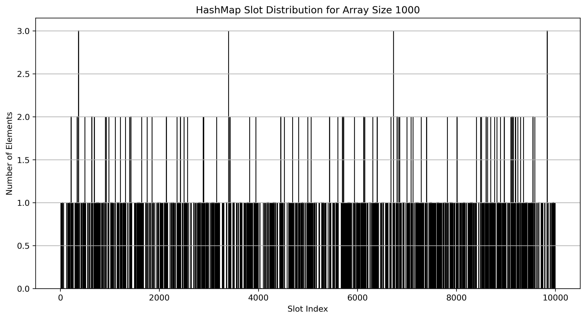
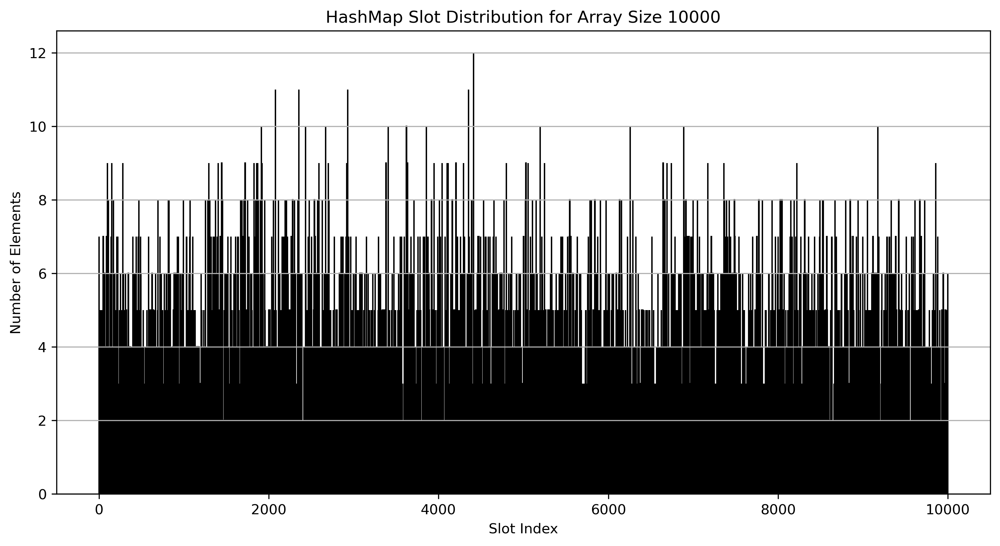
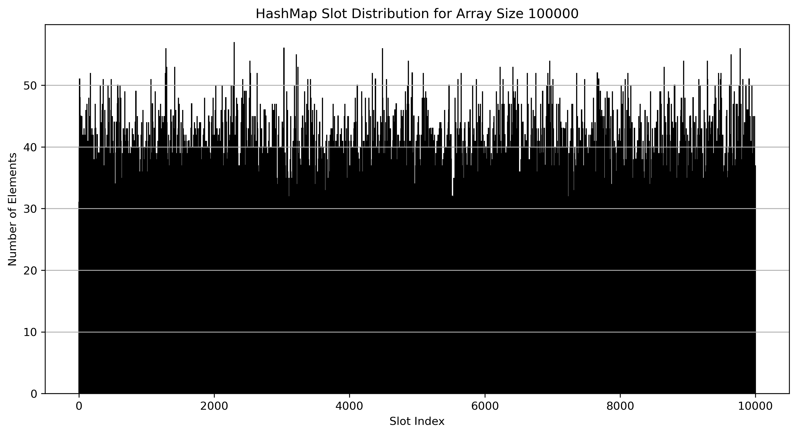
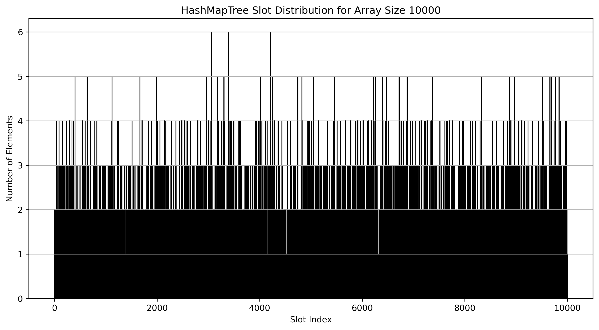

# CS 271 - Project 3: Hash Tables - Group 1

## Project Overview
This project aims to implement different Hash Tables, one with the doubly linked lists and the other with the a balanced binary tree. We also explore the 

**Contributors**:  
- James Bui
- Kien Le
- Trinity Meckel

## Project Structure
```
/
│── Makefile                    # Makefile for compiling the code
│── mytests.cpp                 # CPP file containing different test cases
│── HashMap.cpp                 # File containing definitions for HashMap class
│── HashMap.hpp                 # Header file for HashMap class declarations
│── HashMapTree.cpp             # File containing definitions for HashMapTree class
│── HashMapTree.hpp             # Header file for HashMapTree class declarations
│── Set.cpp                     # File containing definitions for Set class
│── Set.hpp                     # Header file for Set class declarations
│── RBTree.cpp                  # File containing definitions for RBTree class
│── RBTree.hpp                  # Header file for RBTree class declarations
│── RBTreeNode.cpp              # File containing definitions for RBTreeNode class
│── RBTreeNode.hpp              # Header file for RBTreeNode class declarations
│── customexceptions.hpp        # Header file for custom exceptions declarations
```

## Major Design Decisions
We use the DoublyLinkedList for each slot in the hash table in the HashMap class implementations. We also use 

## Group Challenges
I think there are no challenges when we are working together and implementing the algorithms.

## Individual Reflection
**James Bui**: I was primarily responsible for the implementation of the *Set* class and the *HashFunction*. I was also tasked to do the analysis of the hash maps.

## Known Issues
There are no known issues in our code.

## Additional Information
There is no additional information. 

## Analysis 

### Performance of operations


The performance plot of insertion, deletion and searching shows a similar pattern fo each operation. We see that the HashMap class implementation of all three operations performs worse than that of the HashMapTree class. We also see deletion is the fastest for both implementations, while searching is the longest. This makes sense as the deletion operation only receives the pointer to the node as the parameter, while insertion also requires us to check whether that key exist in the table or not. Searching requires us to locate the slot and loop through the element, so it takes the most time out of the three. 

Notice that for small input sizes, the performance is almost identical. But as the input size get to 1,000,000 , the difference become noticeable. 

### Distributions of elements into slots
Below is the histogram of the number of elements per slot for the HashMap class.
 
 
 
 
 

We can see that the distribution is close enough to a uniform distribution for each of the input sizes. The same goes for the HashMapTree class, which also uses the same HashFunction.

 
 
 
 

## Further Considerations 
The implementation of the *Priority Queue* class contains two private variables: an array that represent a max-heap, and a HashMap object is used to represent the hash table. This hash table will map the index in the array to the object. The public methods is as follows:

**Attribute**: 
- hashtable: hash table will map the index in the array to the object.
- heap: a max-heap of the keys of the objects.
- size: size of the priority queue.

**Methods**
- *insert(x, k)*: Just like the MAX-HEAP-INSERT algorithm in the textbook, but when we map x to index *heap_size*, we insert x to hash table using the key of x.
- *maximum()*: Get the first key of the array, then use it to search for the element in the hash table
- *extract_max()*: Using maximum(), we get the object with the maximum key. We then proceed to set the last value of the heap array to the first, reduce the heap_size by 1 and then max_heapify the array. We return the maximum element.
- *increase_key(x, k)*: We check if the key *k* is valid, then find the object x in hash table using its key, and find the index i. We then exchange the object at index i with object at index parent(i). Then we proceeds as the MAX-HEAP-INCREASE-KEY algorithm in the book
- *max_heapify(i)*: turn the array of key into a max-heap, then exchange the mapping of the objects in the hash table accordingly, like the MAX-HEAPIFY algorithm.
- *size()*: return the size of the priority queue.